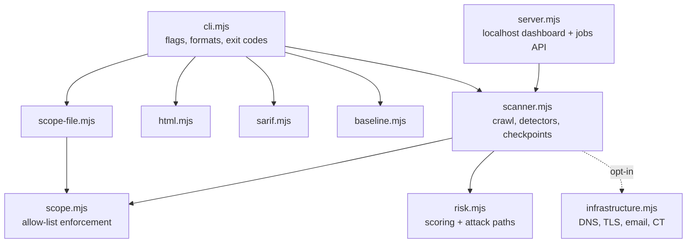
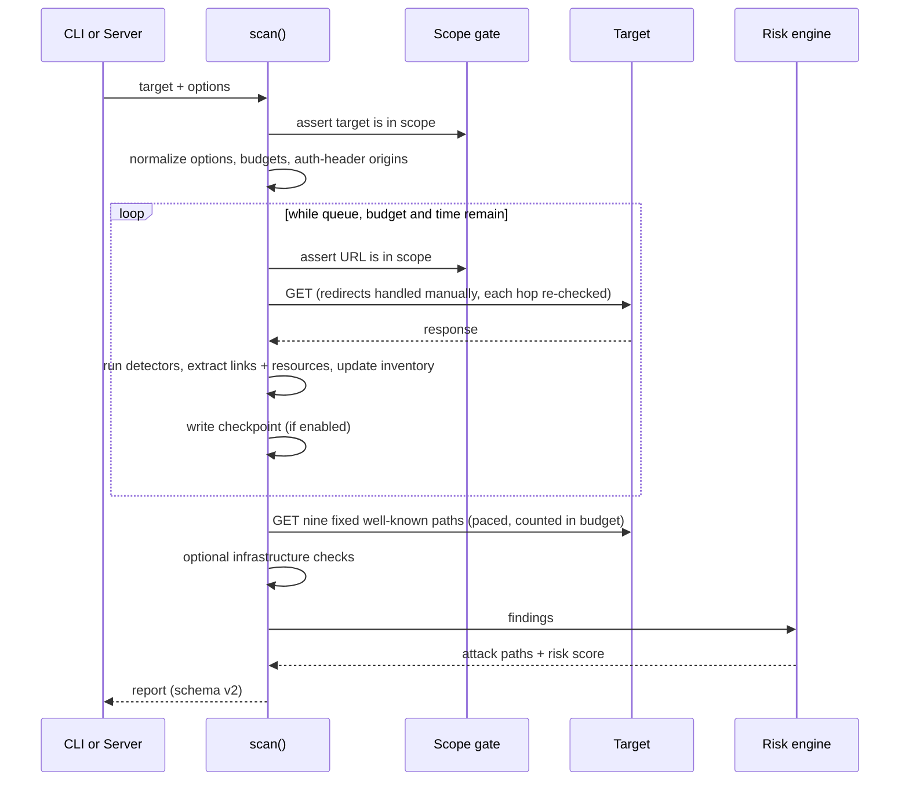

# Architecture

SentinelScan is about 1,900 lines of dependency-free Node.js (ES modules). This page explains how the pieces fit so you can read, extend, or audit them.

- [Module map](#module-map)
- [Scan lifecycle](#scan-lifecycle)
- [Design decisions](#design-decisions)
- [The report](#the-report)
- [Checkpoints](#checkpoints)
- [Extension points](#extension-points)

## Module map



| Module | Responsibility | Lines |
| --- | --- | ---: |
| `scanner.mjs` | Bounded crawl, all detectors, well-known path checks, checkpoints, report assembly | ~1,070 |
| `cli.mjs` | Argument parsing, output formats, baseline comparison | ~170 |
| `server.mjs` | Localhost dashboard, asynchronous scan jobs, budget clamping | ~170 |
| `infrastructure.mjs` | Opt-in DNS, TLS, SPF/DMARC/DKIM/CAA, Certificate Transparency | ~170 |
| `risk.mjs` | Severity weights, diminishing returns, confidence, attack-path rules | ~100 |
| `scope.mjs` | Origin and path allow-listing (exact and leading-subdomain wildcard) | ~70 |
| `baseline.mjs` | Fingerprint-based report comparison | ~50 |
| `html.mjs` | Standalone HTML report (all evidence is escaped) | ~40 |
| `sarif.mjs` | SARIF 2.1.0 export | ~30 |
| `scope-file.mjs` | Loads and validates a scope file | ~10 |

## Scan lifecycle



The crawl is **breadth-first and sequential**. There is no concurrency, which keeps ordering deterministic, makes budgets exact, and keeps load on the target predictable.

## Design decisions

**Scope is checked at three layers.** At enqueue time (so out-of-scope links never enter the queue), immediately before each request, and again on every redirect hop. A bug in one layer does not open the gate.

**Findings are plain data.** Detectors call `finding(id, severity, title, evidence, location, remediation)`, which adds a stable fingerprint and a confidence profile. Nothing about a finding is computed lazily, so reports are trivially serializable, diffable, and cacheable.

**Fingerprints are stable across runs.** A fingerprint is the first 16 hex characters of `sha256("<id>|<origin><path>")`. Query strings are deliberately excluded so a finding keeps its identity when a session parameter changes. This is what makes baseline comparison and cross-run matching work. Because several distinct instances can share a fingerprint (two cookies missing `HttpOnly`, say), baseline comparison matches them as a multiset: by identical evidence first, then by count. Nothing is silently merged.

**Confidence is separate from severity.** Severity says how bad it would be *if real*; confidence says how sure the scanner is. Candidate findings (for example a value that merely *looks* like a secret) carry lower confidence and are discounted in the score.

**Risk uses diminishing returns.** The first occurrence of a finding counts fully, and each repeat counts less (`1/(n+1)`). Crawl depth cannot overwhelm prioritization.

**Attack paths are data.** Correlation rules are a declarative array in `risk.mjs`. Adding a rule needs no new code path.

**Every request is paced.** A single pacer enforces the minimum gap between requests, and every outbound call, including redirect hops and the well-known checks, goes through the one function that consults it. There is no request path that can skip the delay, and the wait is cancelable.

**A timeout is a finding; a cancellation is a stop.** A request that times out is recorded as a `request-failed` finding and the scan continues. Only an operator cancellation (the abort signal) ends the scan.

**Zero dependencies.** Networking uses the built-in `fetch`; tests use `node:test`. There is no dependency tree to review.

## The report

Reports use `schemaVersion: 2`. Top-level keys:

| Key | Contents |
| --- | --- |
| `schemaVersion` | Currently `2` |
| `scanner` | `name`, `version`, `mode` |
| `target`, `scope` | What was scanned and the scope that governed it |
| `startedAt`, `finishedAt` | ISO timestamps |
| `limits` | The effective budgets and auth-header **origins**. Header **values** are never included |
| `summary` | Counts, elapsed time, `termination` reason, severity and confidence breakdowns, risk score and grade |
| `pages`, `resources` | What was visited |
| `requests` | Per-request timeline: URL (redacted), status, elapsed ms, bytes read, redirect target |
| `infrastructure` | DNS/TLS/email/CT metadata (only when enabled) |
| `inventory` | Forms, password forms, scripts, links, client API endpoints, source maps |
| `findings` | Every finding, with fingerprint, evidence, and remediation |
| `attackPaths` | Correlated stories linking finding fingerprints |
| `risk` | `score`, `grade`, `method`, `factors`, per-finding `contributions`, `priority` order |
| `notes` | Execution budget used, whether the queue was exhausted, and reminders |
| `comparison` | Added by the CLI when `--baseline` is used |

`summary.termination` is `queue-exhausted` on a normal finish, or a human-readable reason such as "Maximum page budget reached." when a budget stopped the run early.

## Checkpoints

A checkpoint is a JSON file (`schemaVersion: 2`) holding the queue, visited set, findings, inventory, and request log. It is written after each unit of work by writing a temporary file and renaming it, so an interruption can never leave a half-written checkpoint.

On resume, SentinelScan refuses to continue if the target or the scope differs from the checkpoint. When a checkpoint of a *completed* scan is passed to the CLI, it returns the stored report without contacting the target again.

## Extension points

| I want to... | Touch |
| --- | --- |
| Add a detector | `src/scanner.mjs`, plus a test. See [CONTRIBUTING.md](../CONTRIBUTING.md#adding-a-detector) |
| Add a correlation rule | `DEFAULT_ATTACK_PATH_RULES` in `src/risk.mjs`. See [CONTRIBUTING.md](../CONTRIBUTING.md#adding-an-attack-path-rule) |
| Change a finding's confidence | `FINDING_PROFILES` in `src/scanner.mjs` |
| Add an output format | A small pure function `report => string`, wired into `src/cli.mjs` |
| Call it from your own code | `import { scan } from "./src/scanner.mjs"` (returns the report object) |

```js
import { scan } from "./src/scanner.mjs";

const report = await scan("https://your-authorized-site.example", {
  scope: { name: "prod", allowedOrigins: ["https://your-authorized-site.example"] },
  maxPages: 10,
  delayMs: 500,
});
console.log(report.risk.grade, report.summary.findings);
```
