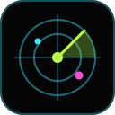
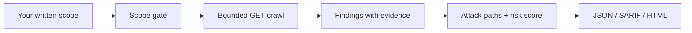

# SentinelScan Documentation

**Everything you need to run it, trust it, and extend it.**

## Start here

| I want to... | Read |
| --- | --- |
| **Try it in a minute** with no target | [README quick start](../README.md#-quick-start-in-60-seconds) |
| **Understand what it will and won't do** | [Safety model](SAFETY.md) |
| **Look up a flag** or write a scope file | [CLI reference](CLI.md) |
| **Drive it from my own tooling** | [Dashboard API](API.md) |
| **Know what it can detect**, and how findings are scored | [Detection catalog](DETECTIONS.md) |
| **Run it in CI** and send findings to Code Scanning | [GitHub Actions](github-actions.md) |
| **See how it is built** | [Architecture](ARCHITECTURE.md) |
| **Contribute a detector** | [Contributing](../CONTRIBUTING.md) |
| **Report a scanner problem** | [Security policy](../SECURITY.md) |

## The 30-second mental model

1. **You** decide what is in scope and confirm authorization.
2. **SentinelScan** sends bounded `GET` requests that never leave that scope.
3. **Findings** carry evidence, confidence, and a fix. Related findings are correlated into attack paths.
4. **You** review the leads. They are not proof of exploitability.

## Also in this folder

| File | What it is |
| --- | --- |
| [`index.html`](index.html) | The static, safe **live demo** (no network requests) |
| [`assets/`](assets/) | Banner, terminal recording, report screenshot, logo, and social preview |
