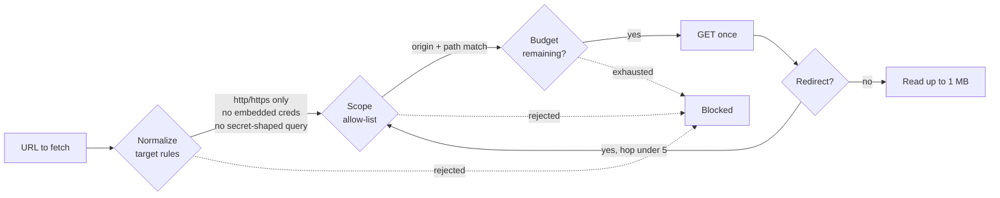

<div align="center">

# 🛡️ Safety Model

**Safety is not a setting in SentinelScan. It is the shape of the program.**

</div>

SentinelScan exists to answer "what does this site expose?" without ever asking "what happens if I push harder?". This document explains the guarantees, where each one is enforced in the code, and how you can verify them yourself.

- [The guarantees](#the-guarantees)
- [What SentinelScan sends](#what-sentinelscan-sends)
- [What it will never do](#what-it-will-never-do)
- [Third-party and non-HTTP lookups](#third-party-and-non-http-lookups)
- [Verify it yourself](#verify-it-yourself)
- [Your responsibilities](#your-responsibilities)

## The guarantees



| # | Guarantee | Enforced by |
| ---: | --- | --- |
| 1 | **No request without explicit authorization.** The CLI needs `--scope` **and** `--confirm-authorized`; the API needs `confirmAuthorized: true`. | `src/cli.mjs`, `src/server.mjs` |
| 2 | **Only `GET`.** The single crawl call site hard-codes `method: "GET"`. Nothing submits a form. | `fetchBounded()` in `src/scanner.mjs` |
| 3 | **Only in-scope URLs.** Every URL is checked against the scope before it is fetched. Out-of-scope links are never even queued. | `assertInScope()` in `src/scope.mjs`, called from `fetchBounded()` and `enqueue()` |
| 4 | **Redirects cannot escape.** Redirects are followed manually (`redirect: "manual"`), and *each hop* passes the scope gate. The limit is 5 hops. | `fetchBounded()` |
| 5 | **Bad targets are rejected up front.** Non-`http(s)` schemes, URLs with embedded usernames or passwords, and credential-shaped query parameters (for example `token`, `api_key`, `password`) are refused. | `normalizeTarget()` |
| 6 | **Secrets are redacted.** Credential-shaped query values become `[REDACTED]` in every URL that reaches a report. | `redactUrl()` |
| 7 | **Hard budgets.** Pages, resources, total requests, wall-clock time, response bytes, and per-request timeout are independent limits. Exhausting any one stops the scan cleanly. | `consumeRequest()`, `canContinue()`, `readBody()` |
| 8 | **A polite request rate.** A minimum gap (default 250 ms) separates any two requests, including redirect hops and the well-known checks. The wait is cancelable. | `createPacer()` in `src/scanner.mjs` |
| 9 | **Credentials go only where you say.** Auth headers are attached only to origins you list (default: the target origin). Wildcard scopes never receive them implicitly. | `authHeaderOrigins` handling in `scan()` |
| 10 | **Credentials never reach disk.** Header values are stripped from the report's `limits` and are not part of checkpoint state. | `scan()`, `writeCheckpoint()` |
| 11 | **Checkpoints can't be replayed elsewhere.** Resuming refuses a different target or a different scope. Writes are atomic (temp file, then rename). | `scan()`, `writeCheckpoint()` |
| 12 | **The dashboard is local.** It binds to `127.0.0.1` by default, runs one job at a time, caps request bodies at 16 KB, and clamps every budget to a hard maximum. | `src/server.mjs` |

### Auth header hardening

Header names must be valid HTTP tokens and cannot be `host`, `content-length`, `connection`, or `transfer-encoding`. Values are limited to 4,096 characters and may not contain CR or LF (no header injection).

### Dashboard budget ceilings

| Budget | Default | Hard maximum via API |
| --- | ---: | ---: |
| Pages | 20 | 50 |
| Resources | 40 | 100 |
| Total requests | 80 | 200 |
| Wall-clock time | 120 s | 600 s |
| Delay between requests | 250 ms | 2,000 ms |
| Per-request timeout | 8 s | 8 s |

## What SentinelScan sends

Every crawl request is a single `GET` with these headers:

```http
accept: text/html,application/xhtml+xml,application/xml;q=0.9,*/*;q=0.1
user-agent: SentinelScan/0.5 (authorized security posture audit)
```

plus your auth headers, **only** for origins you allow-listed.

The requests are:

1. **Pages**: in-scope HTML pages discovered from links, up to the page budget.
2. **Resources**: in-scope `.js`, `.json`, and `.map` files, up to the resource budget.
3. **Nine fixed well-known paths**, each fetched once, counted against the request budget, and paced like every other request:

   `/robots.txt` · `/sitemap.xml` · `/.well-known/security.txt` · `/.git/HEAD` · `/.env` · `/config.json` · `/swagger.json` · `/openapi.json` · `/actuator/env`

This is a fixed list of nine, not a wordlist. There is no directory fuzzing.

> [!NOTE]
> The user agent identifies SentinelScan honestly so site owners can recognise it in their logs.

## What it will never do

- Submit forms, or try any credential (no brute force, no guessing, no stuffing)
- Send exploit payloads or attempt authentication bypass
- Fuzz directories or parameters, or probe for SSRF
- Generate load (requests are sequential, with a 250 ms pause between any two requests by default)
- Follow a link or redirect outside the scope you wrote down

Contributions that add these capabilities are declined. See [SECURITY.md](../SECURITY.md).

## Third-party and non-HTTP lookups

Two features go beyond `GET` requests to your target. **Both are opt-in** and disabled by default.

| Feature | Enabled by | What happens |
| --- | --- | --- |
| **Infrastructure checks** | `--infrastructure` | DNS lookups for the target and email domain (SPF, DMARC, DKIM selectors, CAA) through your resolver, plus, for HTTPS targets, a single TLS handshake to the target host (port from the URL, or 443) to read the certificate. The handshake is closed immediately; no HTTP is sent. |
| **Certificate Transparency** | `--certificate-transparency` | The target **hostname** is looked up on the public **crt.sh** service. This is a third-party request. |

> [!WARNING]
> `--email-domain` may name a domain other than the target. DNS lookups for it are not restricted by your origin scope, so keep it inside your written assessment scope.

## Verify it yourself

You do not have to take our word for it. The scanner is small and dependency-free.

```bash
# Every outbound HTTP call site in the project (expect exactly two:
# the GET in scanner.mjs, and the opt-in crt.sh lookup in infrastructure.mjs)
grep -n "fetch(" src/*.mjs

# Every place a request method is chosen
grep -n 'method:' src/scanner.mjs

# Run the regression suite: local fixtures only, no internet
npm test
```

The test suite includes checks that a scan refuses out-of-scope targets and never leaves the origin.

## Your responsibilities

SentinelScan limits what the *tool* can do. It cannot decide whether you are *allowed* to run it.

- Scan only systems you own or have **written authorization** to assess.
- Follow the service owner's rules of engagement, including maintenance windows and rate limits. Raise `--delay-ms` if in doubt.
- Stop immediately if the owner asks you to.
- Keep reports private. They can include internal URLs and response details.
- Use a **short-lived test session** for authenticated observation, never a personal or production credential.

Findings are review leads, not proof of exploitability. Confirm impact before changing production systems.
