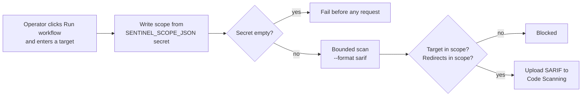

# GitHub Actions

SentinelScan is designed to run safely on GitHub **without placing a target URL, scope, or credentials in source control**.

- [What runs automatically](#what-runs-automatically)
- [The optional authorized scan](#the-optional-authorized-scan)
- [Setup](#setup)
- [How it stays safe](#how-it-stays-safe)
- [Reading the results](#reading-the-results)
- [Troubleshooting](#troubleshooting)

## What runs automatically

These workflows never contact a website.

| Workflow | Trigger | What it does |
| --- | --- | --- |
| **Quality** | Push to `main`/`master`, pull requests | Runs `npm test` and syntax checks on **Node.js 20 and 22** |
| **CodeQL** | Push to `main`/`master`, pull requests, weekly (Mondays 03:23 UTC) | Read-only JavaScript security analysis |
| **Dependabot** | Monthly | Proposes updates to pinned GitHub Action versions |

## The optional authorized scan

The **Authorized SentinelScan** workflow is manual **by design**. It runs only when an operator chooses **Run workflow** and supplies a target.



Key properties of the workflow:

- Runs only on `workflow_dispatch` with a required `target` input
- 10-minute job timeout
- Permissions limited to `contents: read` and `security-events: write`
- Uses `--confirm-authorized`: **choosing Run workflow is your confirmation**, so restrict who can do it
- Produces SARIF and uploads it to GitHub Code Scanning under the category `sentinelscan`

## Setup

1. Open the repository's **Settings**, then **Secrets and variables**, then **Actions**.
2. Add a repository secret named **`SENTINEL_SCOPE_JSON`**.
3. Set its value to a scope, for example:

```json
{
  "name": "authorized-production-scope",
  "allowedOrigins": [
    "https://your-authorized-site.example",
    "https://*.assets.your-authorized-site.example"
  ],
  "excludePaths": ["/logout"]
}
```

4. Go to **Actions**, choose **Authorized SentinelScan**, click **Run workflow**, and enter a target that is inside that scope.

The scope format is the same as the CLI's. See the [scope file reference](CLI.md#scope-file).

## How it stays safe

| Protection | Detail |
| --- | --- |
| **No scope in source control** | The scope lives in an encrypted repository secret and is written to a git-ignored local file at run time |
| **Empty scope refused** | The workflow fails if the secret is empty |
| **Scope enforced by the scanner** | A target outside the allowed exact or wildcard origins is blocked, and so are redirects outside the scope or configured paths |
| **Bounded** | Default budgets apply: 20 pages, 40 resources, 80 requests, 120 seconds |
| **Opt-in extras** | Infrastructure and Certificate Transparency checks are **off** in CI. Enable them only if they are inside the written assessment scope |
| **Least privilege** | The token can read contents and write security events, nothing else |

> [!IMPORTANT]
> Restrict the scope secret to trusted repository maintainers, and keep a written authorization record for every target you scan.

## Reading the results

SARIF findings appear in the repository's **Security** tab under **Code scanning**.

| SentinelScan severity | SARIF level |
| --- | --- |
| high | `error` |
| medium | `warning` |
| low, info | `note` |

Each result carries the finding's stable fingerprint in the SARIF `fingerprints.sentinelscan` field, so the same issue can be matched across runs.

## Troubleshooting

| Symptom | Likely cause |
| --- | --- |
| Workflow fails at "Write private scope file" | `SENTINEL_SCOPE_JSON` is missing or empty |
| `Out-of-scope navigation blocked` | The target (or a redirect) is not inside the scope. Add the origin to the secret **only if** it is authorized |
| Every request fails | GitHub-hosted runners cannot reach the target (private network, IP allow-list, or a WAF blocking cloud IPs). Scan from an environment that can, using the CLI |
| SARIF upload fails | Code scanning is unavailable for the repository (private repositories may need GitHub Advanced Security) |
| Scan stops early | A budget was reached. The report's `summary.termination` explains which one |

For local runs, see the [CLI reference](CLI.md).
